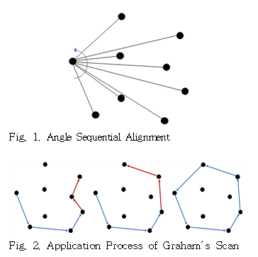
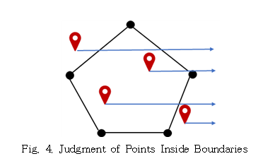
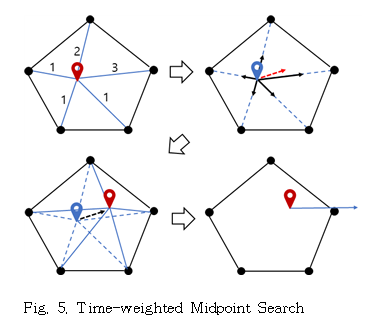
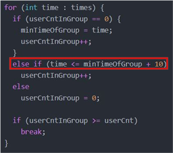
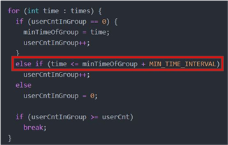
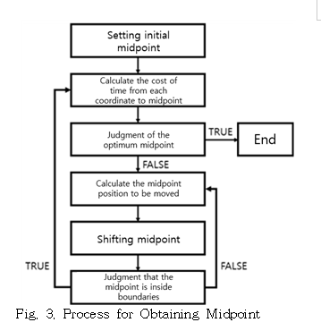
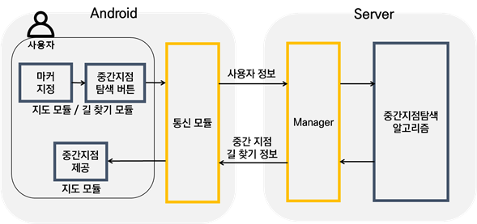
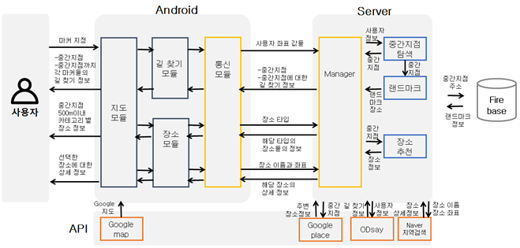

# TOMSA(TimeOptimizationMidSearchAlgorithm)

## DamoYeo

### 문제해결기법 1조 프로젝트

## 개요
거리뿐만 아니라, 각 사용자의 위치에서 중간지점까지 대중교통으로 소요되는 시간도 고려하는 최적의 중간지점을 찾아내는 알고리즘을 만들자.

## 개발 언어 및 환경
* C++
* Ubuntu
* Visual Studio

## 사용된 알고리즘
* Graham's Scan : 바깥 이용자들의 위치를 이어 형성된 다각형의 범위를 구하기 위한 알고리즘

* Point in a polygon : 구해진 중간 지점의 좌표가 Graham's Scan 알고리즘으로 도출된 다각형 안에 있는지 확인하기 위한 알고리즘

* 무게중심 : 초기 중간지점의 좌표를 구하기 위함.

* 간단한 유전자 알고리즘 : 여러개의 표본에 대하여 특정 가중치 값를 가감해 나가면서 조건에 맞는 중간지점을 도출하기 위함

* 중간 지점 옮기기 : 도출된 중간지점으로부터 각 사용자까지의 벡터 값을 이용하여 새로운 중간 지점을 구함.

## 팀원
* 컴퓨터공학과 김태우 : 시간 가중치 기반 최적 경로 탐색 알고리즘 설계, C++ 코드를 Ubuntu 환경에서 이용할 수 있도록 설정, Point in a polygon 알고리즘 구현, 총괄
* 컴퓨터공학과 허유성 : 시간 가중치 기반 최적 경로 탐색 알고리즘 설계, Graham's Scan 알고리즘 구현, 유전자 알고리즘을 이용한 테스트 코드 구현

## 개발하면서 생긴 문제점 및 개선

* 고정된 최적 비용 만족 시간

중간 지점 탐색 알고리즘 수행 과정에서 설계 당시 사용자간의 통행비용 차이가 10분 이내를 만족하는 경우만 최적 중간 지점을 찾은 것으로 하고, 탐색을 종료하기로 하였었다. 하지만 탐색 과정에서, 우리가 생각한 최적 중간 지점의 주변을 순회하지만, 통행비용의 오차가 10분 이내에 들지 않아 무한히 탐색을 수행하는 문제가 발생하였다. 따라서 탐색 과정이 진행될수록 통행비용의 오차를 5분씩 증가시키며 최적의 중간 지점을 찾도록 수정하여, 보다 효율적인 탐색을 수행할 수 있도록 하였다.

* 능동적인 최적 비용 만족 시간

## 알고리즘 프로세스

## 어플 '다모여'의 데이터 흐름도

## 비고
다모여 프로젝트 제작과 병행하여 '시간 가중치 기반 효율적인 최적 경로 탐색 기법 연구' 라는 주제로 논문을 작성했고

2020년 2월 한국융합학회논문지에 등재되었음. 

해당 논문 링크 : https://www.earticle.net/Article/A369922
